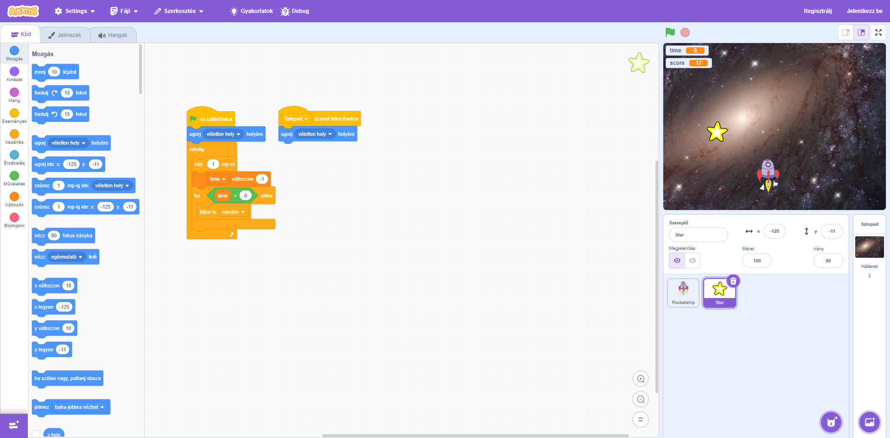
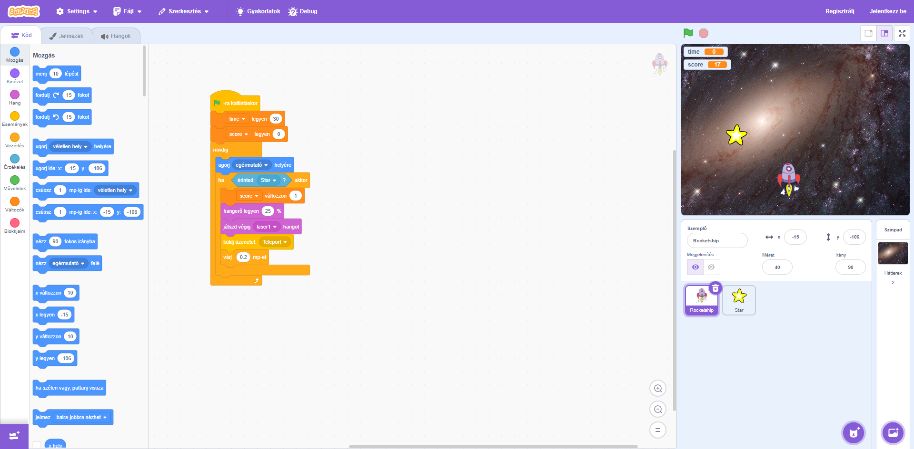

# Space Scavenger - Scratch Project ([20200203a](https://arato.inf.unideb.hu/szathmary.laszlo/pmwiki/index.php?n=Prog1.20200203a))

This is my first scratch project for the **Programming 1** course. It is an interactive game where you control a rocketship to collect stars within a time limit.

## Features

- **Player Movement:** Follows the mouse pointer.
- **Score System:** Increases when touching the star.
- **Timer:** 30-second countdown.
- **Sound Effects:** Laser sound on collection.

## Gameplay

